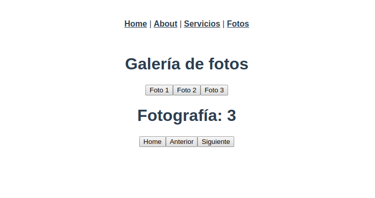

# Proyecto Vue 2: Ejemplo con Vue router

### Vue js 2 Completo ¡De 0 a Experto! + Firebase + Node [MEVN]
### Vue.js 2 Aprende con la práctica, descubriendo Vuex, Rutas protegidas, Vue CLI 3 UI, Nuxt.js, Node.js, Express y MongoDB

### VUE ROUTER | Aprendiendo a trabajar con rutas
- Instalar proyecto con Vue CLI 3 UI y Router
- Creando nuestra primera ruta
- router-link y rutas con parámetros
- Parámetros dinámicos y rutas en eventos @click
